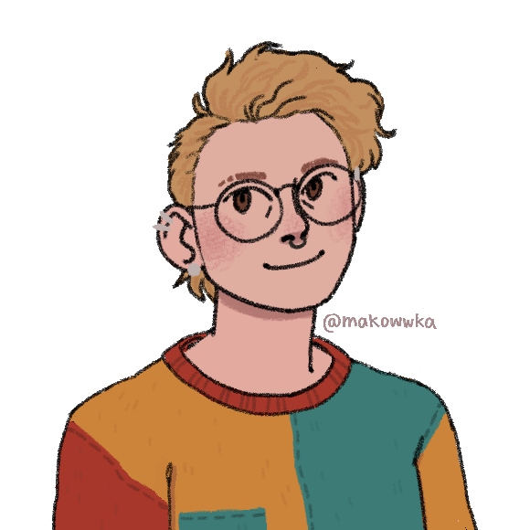

# Primeiro Projeto Front-End
## Mini-blog de Euphoria
### Projeto feito individualmente para o Bootcamp da **Generation Brasil** - 2022

 

 

## Descrição
Blog com tema livre para aprendizagem de desenvolvimento front-end.

 

## Linguagens utilizadas:
> [HTML](https://developer.mozilla.org/pt-BR/docs/Web/HTML "Linguagem de Marcação")

> [CSS](https://developer.mozilla.org/pt-BR/docs/Web/CSS "Cascading Style Sheets")

> [JavaScript](https://developer.mozilla.org/pt-BR/docs/Web/JavaScript "JS")

 

<table>
    <tr>
       <td align="center"><a href="https://linktr.ee/catarinarinaldi" title="Me conheça mais"> <b>Catarina Rinaldi</b></a> </td>
    </tr>
</table>

Projeto e read.me feito por Catarina Rinaldi
